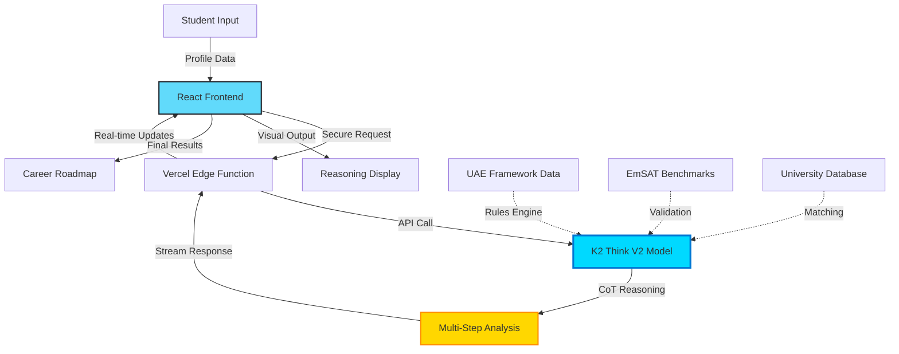
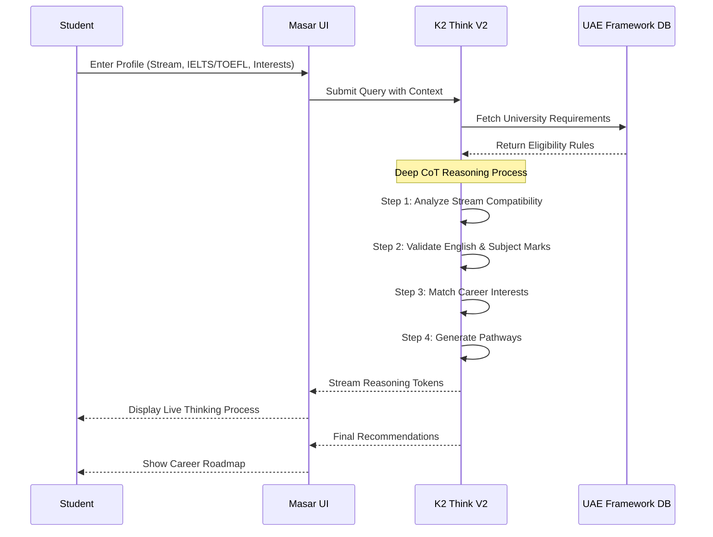
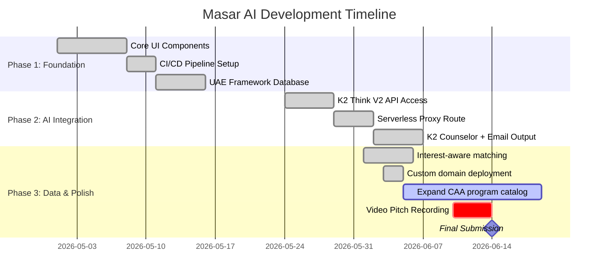

# Masar AI (مسار): Next-Gen Student Pathway Reasoning Agent

<div align="center">


**Beyond Theory. Building Reality.**

*An intelligent academic pathway counselor powered by K2 Think V2's advanced reasoning capabilities*

[🚀 Live Demo](https://read.buildingtheitguy.com) • [📖 Documentation](#-the-problem--core-reasoning-focus) • [🎯 Roadmap](#-roadmap--next-milestone-execution)

</div>

---

## 🌟 Overview

Masar AI is an intelligent, automated academic pathway counselor built specifically for K-12 high school graduates in the United Arab Emirates. Leveraging the advanced, multi-step long Chain-of-Thought (CoT) reasoning capabilities of the **K2 Think V2** model, Masar AI synthesizes diverse high school curriculums (MoE General/Advanced, CBSE, British, American), **IELTS/TOEFL** English proficiency, subject marks, and individual student passions to output compliant, optimized university degree trajectories and localized career maps.

**Production app:** [read.buildingtheitguy.com](https://read.buildingtheitguy.com)

---

## 🎯 System Architecture



---

## 🧠 The Problem & Core Reasoning Focus

Navigating the transition from high school to higher education in the UAE is increasingly complex due to a rapidly evolving academic landscape:

<table>
<tr>
<td width="33%" align="center">

<h3>Dynamic Streams</h3>
Recent MoE track shifts (Advanced vs. General) create alignment confusion
</td>
<td width="33%" align="center">

<h3>Fragmented Prerequisites</h3>
Varying EmSAT benchmarks across universities lead to manual evaluation errors
</td>
<td width="33%" align="center">

<h3>Market Alignment</h3>
Difficulty mapping majors to future sectors like Space Tech, Cyber Security, AI
</td>
</tr>
</table>

### 💡 Why K2 Think V2?

Determining an academic trajectory is not a basic data-lookup or classification task. It requires evaluating sequential dependencies:

> *"If a student has a specific curriculum track, with X score in EmSAT Math, but prefers people-centric data systems over hardware, what paths are viable at CAA-accredited institutions like the University of Dubai?"*

**Masar AI utilizes K2 Think V2's deep reasoning tokens to:**
- ✅ Evaluate multi-variable logic trees sequentially
- ✅ Filter out unviable options with transparent reasoning
- ✅ Detail exact programmatic rationale behind choices
- ✅ Provide step-by-step Chain-of-Thought explanations

---

## 🔄 Student Journey Flow



---

## 🛠️ Architecture & Tech Stack

<div align="center">

| Layer | Technology | Purpose |
|-------|-----------|---------|
| **Frontend** | React 19 + Vite | Modern UI with automatic optimization via React Compiler |
| **Deployment** | Vercel (Edge) | Automated CI/CD with global CDN distribution |
| **Backend** | Serverless Functions | Secure API proxy for K2 Think V2 integration |
| **AI Engine** | K2 Think V2 | Advanced multi-step Chain-of-Thought reasoning |
| **Data Layer** | JSON Knowledge Base | Structured UAE university admission frameworks |

</div>

---

## 📁 Repository Directory Structure

```text
masar-ai/
├── 📄 vercel.json            # Edge routing + API functions
├── 📄 index.html             # Application entry point
├── 📂 api/
│   ├── chat.js               # K2 Think streaming + email/Supabase
│   └── log-profile.js        # Early profile capture
├── 📂 lib/
│   └── supabaseStudent.js    # Shared Supabase insert helper
├── 📦 package.json
└── 📂 src/
    ├── 🚀 main.jsx
    ├── 🎯 App.jsx            # Layout, matching results, K2 panel
    ├── 📂 data/
    │   ├── programs.json     # UAE undergraduate programs (CAA-aligned)
    │   ├── universities.json
    │   └── framework.json
    ├── 📂 components/
    │   ├── ExploreWizard.jsx # Interest quiz + behavioral sorter
    │   ├── K2CounselorPanel.jsx
    │   ├── FormInput.jsx
    │   └── ...
    └── 📂 lib/
        ├── matchPrograms.js  # Track + interest-aware matching
        └── buildK2Context.js
```

---

## ⚙️ Local Development Instructions

To clone, modify, and run this project locally on your machine:

### 1️⃣ Clone the Repository
```bash
git clone https://github.com/BuildingTHEITGUY/masar-ai.git
cd masar-ai
```

### 2️⃣ Install Dependencies
```bash
npm install
```

### 3️⃣ Run the Development Server
```bash
npm run dev
```

Once started, open your browser to `http://localhost:5173/` 🎉

---

## 📈 Roadmap & Next Milestone Execution



### ✅ Progress Tracker

- [x] **Phase 1.1** — Core UI intake + Explore wizard (interests, priorities, behavioral sorter)
- [x] **Phase 1.2** — CI/CD via Vercel + custom domain **[read.buildingtheitguy.com](https://read.buildingtheitguy.com)**
- [x] **Phase 1.3** — `programs.json` / `universities.json` knowledge base (57+ programs, 26 institutions)
- [x] **Phase 2.1** — K2 Think V2 API integration (streaming CoT)
- [x] **Phase 2.2** — Serverless `/api/chat` + `/api/log-profile` proxy routes
- [x] **Phase 2.3** — K2 Counselor panel with sanitized roadmap output + follow-up chat
- [x] **Phase 2.4** — Supabase student logging + Resend email notifications
- [x] **Phase 2.5** — IELTS/TOEFL English proficiency + subject marks (Math, Physics, English)
- [x] **Phase 3.1** — Interest-aware matching (AI, Cybersecurity, CS, Data Science sub-tracks)
- [ ] **Phase 3.2** — Expand CAA-licensed HEI coverage (target 300+ program rows)
- [ ] **Phase 3.3** — Record and attach 2-minute project submission video pitch *(Deadline: June 14, 2026)*

---

## 🎥 Demo Preview

<div align="center">

### Student Input Interface
*Capture high school stream, EmSAT scores, and career interests*

⬇️

### K2 Think V2 Reasoning Process
*Watch the AI think through complex pathway decisions step-by-step*

⬇️

### Personalized Career Roadmap
*Receive tailored university programs and career trajectories*

**[🚀 Try Live Demo](https://read.buildingtheitguy.com)**

</div>

---

## 🏆 Hackathon Submission Details

<table>
<tr>
<td><strong>Event</strong></td>
<td>MBZUAI K2 Think V2 Hackathon - Round Three</td>
</tr>
<tr>
<td><strong>Focus</strong></td>
<td>Advanced Chain-of-Thought Reasoning Applications</td>
</tr>
<tr>
<td><strong>Target Market</strong></td>
<td>UAE K-12 High School Graduates</td>
</tr>
<tr>
<td><strong>Submission Deadline</strong></td>
<td>June 14, 2026</td>
</tr>
<tr>
<td><strong>Live Demo</strong></td>
<td><a href="https://read.buildingtheitguy.com">read.buildingtheitguy.com</a></td>
</tr>
<tr>
<td><strong>Built by</strong></td>
<td><a href="https://www.buildingtheitguy.com/index.php/about-me/">Building THE IT GUY</a></td>
</tr>
</table>

---

## 🌍 Impact & Vision

Masar AI aims to democratize access to quality academic counseling across the UAE by:

- 🎓 **Reducing Decision Anxiety** - Clear, reasoned pathways eliminate uncertainty
- 🤖 **Scaling Expert Knowledge** - AI-powered guidance available 24/7
- 🇦🇪 **Localizing Global AI** - Tailored specifically for UAE education system
- 🔮 **Future-Proofing Careers** - Aligning education with emerging market needs

---

## 📝 License & Intellectual Property

### Ownership & Attribution

This repository and its contents are developed independently by **BuildingTHEITGUY** as part of the formal submission for the **MBZUAI K2 Think V2 Hackathon (Round Three - June 2026)**.

### Open Source Commitment

This project is open-source and available under the terms of the **[MIT License](LICENSE)**.

**You are free to:**
- ✅ Use the code for personal or commercial projects
- ✅ Modify and distribute the source code
- ✅ Use it as a learning resource

**With the following conditions:**
- 📌 Proper attribution to the original author
- 📌 Include the original MIT License in distributions
- 📌 No warranty or liability is provided

### Hackathon Submission Rights

By participating in the MBZUAI K2 Think V2 Hackathon, this project submission adheres to all competition terms and conditions as outlined by Mohamed bin Zayed University of Artificial Intelligence. Any intellectual property considerations specific to the hackathon evaluation process are governed by the official competition guidelines.

### Third-Party Components

- **K2 Think V2 Model**: Usage subject to MBZUAI API terms and conditions
- **UAE Education Framework Data**: Compiled from publicly available Ministry of Education resources
- **React, Vite, Vercel**: Used under their respective open-source licenses

---

## 🤝 Contributing

### Current Status: Hackathon Evaluation Phase

This repository is currently structured for the **active hackathon evaluation period** (May - June 2026). During this phase, the codebase is in a submission-locked state to maintain integrity for judging purposes.

### Post-Hackathon Contributions Welcome!

**After June 14, 2026**, we enthusiastically welcome:

- 🐛 **Bug Reports** - Help identify edge cases in UAE curriculum mapping
- 💡 **Feature Requests** - Suggest enhancements for student pathway logic
- 🔧 **Pull Requests** - Improve EmSAT score validation algorithms
- 📚 **Documentation** - Expand guides for other regional education systems
- 🌍 **Localization** - Adapt the framework for other GCC countries

### How to Contribute

1. **Fork** the repository
2. Create your feature branch
   ```bash
   git checkout -b feature/ImprovedEmSATValidation
   ```
3. Commit your changes with clear messages
   ```bash
   git commit -m 'feat: Add support for new MoE 2027 stream classifications'
   ```
4. Push to your branch
   ```bash
   git push origin feature/ImprovedEmSATValidation
   ```
5. Open a **Pull Request** with detailed description

### Contribution Guidelines

- Follow existing code style and React 19 best practices
- Include comments for complex UAE education system logic
- Test thoroughly with diverse student profile scenarios
- Update documentation for any new features

---

## 📧 Contact & Support

### For This Project

- **Technical Questions**: Open a detailed issue in the [Issues](https://github.com/BuildingTHEITGUY/masar-ai/issues) tab
- **Architecture Feedback**: Tag with `architecture` label
- **Data Modeling Suggestions**: Tag with `data-model` label
- **UAE Education System Queries**: Tag with `uae-framework` label

### General Inquiries

For collaboration opportunities, speaking engagements, or consulting on AI-powered education technology:

<div align="center">

[](https://github.com/BuildingTHEITGUY/masar-ai/issues)
[](https://github.com/BuildingTHEITGUY/masar-ai/discussions)

</div>

### Response Time

- **During Hackathon** (May 24 - June 14, 2026): Limited availability due to development focus
- **Post-Hackathon**: Typically respond within 48-72 hours

---

## ⚖️ Disclaimer

This tool provides **guidance and recommendations** based on publicly available UAE education framework data and AI-powered reasoning. It should be used as a **supplementary resource** alongside:

- Official university admission counselors
- Ministry of Education guidance
- CAA-accredited institutional advisors

**Masar AI does not guarantee admission** to any educational institution and is not affiliated with or endorsed by any UAE university or government entity.

---

<div align="center">

**Made with ❤️ in the UAE 🇦🇪 | Powered by K2 Think V2 🚀**

*Empowering the next generation of Emirati innovators through intelligent academic guidance*

</div>
